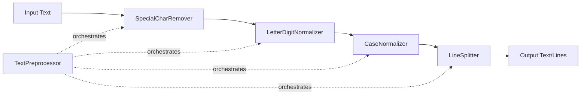

# وثيقة التصميم التقني - تنظيف النص من OCR

## Overview

### الهدف
تصميم نظام معالجة نصوص شامل لتنظيف وتوحيد النصوص الناتجة من أنظمة OCR. النظام يعالج المشاكل الشائعة في مخرجات OCR مثل الرموز الخاصة غير المرغوبة، الخلط بين الحروف والأرقام، وعدم انتظام التنسيق.

### النطاق
- معالجة النصوص العربية والإنجليزية
- إزالة الرموز الخاصة مع الحفاظ على الحروف والأرقام
- توحيد الحروف التي يتم الخلط بينها مع الأرقام (O→0, I/l→1)
- تقسيم النص إلى سطور وتنظيفها
- تحويل النص الإنجليزي إلى أحرف صغيرة
- معالجة الأخطاء والحالات الحدية

### القيود والافتراضات
- النظام يعمل على نصوص UTF-8
- الحد الأقصى لطول النص: 1 مليون حرف
- النظام لا يقوم بتصحيح الأخطاء الإملائية
- النظام يفترض أن المدخلات هي نصوص من OCR وليست نصوص عامة

## Architecture

### النمط المعماري
النظام يتبع نمط **Pipeline Architecture** حيث يمر النص عبر سلسلة من مراحل المعالجة المستقلة:

```
OCR Text → Remove Special Chars → Normalize Letters/Digits → Lowercase → Split Lines → Clean Text
```

### المكونات الرئيسية



### مبادئ التصميم

1. **Single Responsibility**: كل مكون مسؤول عن عملية تنظيف واحدة
2. **Composability**: يمكن استخدام كل مكون بشكل مستقل أو مع مكونات أخرى
3. **Immutability**: المكونات لا تعدل النص الأصلي، بل تنتج نصاً جديداً
4. **Fail-Safe**: معالجة الأخطاء بشكل واضح دون تعطيل النظام

## Components and Interfaces

### 1. SpecialCharRemover

**المسؤولية**: إزالة الرموز الخاصة من النص مع الحفاظ على الحروف والأرقام والمسافات وفواصل الأسطر.

**الواجهة**:
```python
class SpecialCharRemover:
    def remove(self, text: str) -> str:
        """
        إزالة جميع الرموز الخاصة من النص.
        
        Args:
            text: النص المراد تنظيفه
            
        Returns:
            النص بعد إزالة الرموز الخاصة
            
        Raises:
            TypeError: إذا لم يكن المدخل نصاً
            ValueError: إذا كان المدخل None
        """
        pass
```

**التفاصيل التقنية**:
- استخدام regular expressions للكشف عن الرموز الخاصة
- الحفاظ على: حروف عربية (Unicode range: \u0600-\u06FF)، حروف إنجليزية (a-zA-Z)، أرقام (0-9)، مسافات، فواصل أسطر (\n, \r)
- إزالة: جميع الرموز الأخرى (#, *, @, %, &, $, إلخ)

### 2. LetterDigitNormalizer

**المسؤولية**: توحيد الحروف التي يتم الخلط بينها مع الأرقام بناءً على السياق.

**الواجهة**:
```python
class LetterDigitNormalizer:
    def normalize(self, text: str) -> str:
        """
        توحيد الحروف والأرقام المتشابهة بناءً على السياق.
        
        Args:
            text: النص المراد توحيده
            
        Returns:
            النص بعد التوحيد
            
        Raises:
            TypeError: إذا لم يكن المدخل نصاً
            ValueError: إذا كان المدخل None
        """
        pass
    
    def _is_numeric_context(self, text: str, position: int, window_size: int = 2) -> bool:
        """
        تحديد ما إذا كان الحرف في سياق رقمي.
        
        Args:
            text: النص الكامل
            position: موقع الحرف
            window_size: عدد الأحرف المجاورة للفحص
            
        Returns:
            True إذا كان السياق رقمياً
        """
        pass
```

**التفاصيل التقنية**:
- **تحديد السياق الرقمي**: فحص الأحرف المجاورة (قبل وبعد) بمسافة 2 أحرف
- **قواعد التحويل**:
  - `O` (حرف O كبير) → `0` (رقم صفر) في السياق الرقمي
  - `l` (حرف L صغير) → `1` (رقم واحد) في السياق الرقمي
  - `I` (حرف I كبير) → `1` (رقم واحد) في السياق الرقمي
- **السياق الرقمي**: يُعتبر السياق رقمياً إذا كان هناك رقم واحد على الأقل في النافذة المجاورة

### 3. CaseNormalizer

**المسؤولية**: تحويل الحروف الإنجليزية إلى أحرف صغيرة مع الحفاظ على النص العربي.

**الواجهة**:
```python
class CaseNormalizer:
    def to_lowercase(self, text: str) -> str:
        """
        تحويل الحروف الإنجليزية إلى أحرف صغيرة.
        
        Args:
            text: النص المراد تحويله
            
        Returns:
            النص بعد التحويل
            
        Raises:
            TypeError: إذا لم يكن المدخل نصاً
            ValueError: إذا كان المدخل None
        """
        pass
```

**التفاصيل التقنية**:
- استخدام `str.lower()` للحروف الإنجليزية
- الحروف العربية والأرقام تبقى دون تغيير
- العملية idempotent: تطبيقها مرتين ينتج نفس النتيجة

### 4. LineSplitter

**المسؤولية**: تقسيم النص إلى سطور منفصلة وتنظيف كل سطر.

**الواجهة**:
```python
class LineSplitter:
    def split(self, text: str) -> list[str]:
        """
        تقسيم النص إلى سطور وتنظيفها.
        
        Args:
            text: النص المراد تقسيمه
            
        Returns:
            قائمة من السطور النظيفة (بدون سطور فارغة)
            
        Raises:
            TypeError: إذا لم يكن المدخل نصاً
            ValueError: إذا كان المدخل None
        """
        pass
```

**التفاصيل التقنية**:
- التعامل مع جميع أنواع فواصل الأسطر: `\n`, `\r\n`, `\r`
- استخدام `str.splitlines()` للتقسيم
- تطبيق `strip()` على كل سطر لإزالة المسافات الزائدة
- تصفية السطور الفارغة من النتيجة

### 5. TextPreprocessor (Facade)

**المسؤولية**: توفير واجهة موحدة لتطبيق جميع عمليات التنظيف.

**الواجهة**:
```python
class TextPreprocessor:
    def __init__(self):
        self.special_char_remover = SpecialCharRemover()
        self.letter_digit_normalizer = LetterDigitNormalizer()
        self.case_normalizer = CaseNormalizer()
        self.line_splitter = LineSplitter()
    
    def preprocess(
        self,
        text: str,
        remove_special_chars: bool = True,
        normalize_letters: bool = True,
        lowercase: bool = True,
        split_lines: bool = True
    ) -> str | list[str]:
        """
        تطبيق جميع عمليات التنظيف على النص.
        
        Args:
            text: النص المراد معالجته
            remove_special_chars: تفعيل إزالة الرموز الخاصة
            normalize_letters: تفعيل توحيد الحروف والأرقام
            lowercase: تفعيل تحويل إلى أحرف صغيرة
            split_lines: تفعيل تقسيم إلى سطور
            
        Returns:
            النص المعالج (string إذا split_lines=False، list إذا split_lines=True)
            
        Raises:
            TypeError: إذا لم يكن المدخل نصاً
            ValueError: إذا كان المدخل None أو فارغاً
        """
        pass
    
    def remove_special_chars(self, text: str) -> str:
        """واجهة مباشرة لإزالة الرموز الخاصة"""
        pass
    
    def normalize_letters(self, text: str) -> str:
        """واجهة مباشرة لتوحيد الحروف والأرقام"""
        pass
    
    def to_lowercase(self, text: str) -> str:
        """واجهة مباشرة لتحويل إلى أحرف صغيرة"""
        pass
    
    def split_lines(self, text: str) -> list[str]:
        """واجهة مباشرة لتقسيم إلى سطور"""
        pass
```

**التفاصيل التقنية**:
- **ترتيب المعالجة**: 
  1. إزالة الرموز الخاصة
  2. توحيد الحروف والأرقام
  3. تحويل إلى أحرف صغيرة
  4. تقسيم إلى سطور
- **المرونة**: يمكن تفعيل/تعطيل أي عملية عبر المعاملات
- **نوع الإرجاع**: string إذا لم يتم التقسيم، list[str] إذا تم التقسيم

## Data Models

### Input Data

```python
@dataclass
class OCRText:
    """تمثيل النص الخام من OCR"""
    content: str
    source: str | None = None  # مصدر النص (اختياري)
    language: str = "mixed"  # اللغة: "ar", "en", "mixed"
    
    def __post_init__(self):
        if self.content is None:
            raise ValueError("محتوى النص لا يمكن أن يكون None")
        if not isinstance(self.content, str):
            raise TypeError(f"محتوى النص يجب أن يكون string، وليس {type(self.content)}")
```

### Output Data

```python
@dataclass
class CleanedText:
    """تمثيل النص بعد التنظيف"""
    content: str | list[str]
    original_length: int
    cleaned_length: int
    operations_applied: list[str]
    
    @property
    def reduction_ratio(self) -> float:
        """نسبة التقليل في طول النص"""
        if self.original_length == 0:
            return 0.0
        return 1 - (self.cleaned_length / self.original_length)
```

### Configuration

```python
@dataclass
class PreprocessingConfig:
    """إعدادات المعالجة"""
    remove_special_chars: bool = True
    normalize_letters: bool = True
    lowercase: bool = True
    split_lines: bool = True
    max_text_length: int = 1_000_000
    context_window_size: int = 2  # لتحديد السياق الرقمي
```

### Internal Data Structures

```python
# قائمة الرموز الخاصة المراد إزالتها
SPECIAL_CHARS_PATTERN = r'[^\u0600-\u06FFa-zA-Z0-9\s\n\r]'

# قواعد التحويل للحروف والأرقام
LETTER_TO_DIGIT_RULES = {
    'O': '0',  # حرف O كبير
    'l': '1',  # حرف L صغير
    'I': '1',  # حرف I كبير
}

# أنواع فواصل الأسطر
LINE_SEPARATORS = ['\r\n', '\n', '\r']
```


## Correctness Properties

*A property is a characteristic or behavior that should hold true across all valid executions of a system—essentially, a formal statement about what the system should do. Properties serve as the bridge between human-readable specifications and machine-verifiable correctness guarantees.*

### Property 1: Special Character Removal Preserves Valid Content

*For any* text input, after removing special characters, the resulting text SHALL contain only letters (Arabic and English), digits, spaces, and line breaks, AND all original letters, digits, spaces, and line breaks SHALL be preserved in their original order.

**Validates: Requirements 1.1, 1.2, 1.3**

### Property 2: Special Character Removal Idempotence on Clean Text

*For any* text that contains only letters, digits, spaces, and line breaks (no special characters), applying special character removal SHALL produce an identical result to the input.

**Validates: Requirements 1.5 (modified)**

### Property 3: Letter-to-Digit Conversion in Numeric Context

*For any* text containing 'O', 'I', or 'l' characters surrounded by digits (within a window of 2 characters), these characters SHALL be converted to their numeric equivalents ('O'→'0', 'I'→'1', 'l'→'1').

**Validates: Requirements 2.1, 2.2**

### Property 4: Letter Preservation in Text Context

*For any* text containing 'O', 'I', or 'l' characters NOT surrounded by digits (in a text context), these characters SHALL remain unchanged after normalization.

**Validates: Requirements 2.4**

### Property 5: Line Splitting Count Constraint

*For any* text input, the number of lines in the split result SHALL be less than or equal to (the number of line separators in the original text + 1).

**Validates: Requirements 3.5**

### Property 6: Line Splitting Produces Clean Lines

*For any* text input, after splitting into lines, each resulting line SHALL NOT start or end with whitespace, AND the result SHALL NOT contain any empty lines.

**Validates: Requirements 3.2, 3.3**

### Property 7: Lowercase Conversion Completeness

*For any* text input, after applying lowercase conversion, the result SHALL NOT contain any uppercase English letters (A-Z), AND all Arabic text and digits SHALL remain unchanged.

**Validates: Requirements 4.1, 4.2, 4.3**

### Property 8: Lowercase Conversion Idempotence

*For any* text input, applying lowercase conversion twice SHALL produce the same result as applying it once: `lowercase(lowercase(text)) = lowercase(text)`.

**Validates: Requirements 4.5**

### Property 9: Full Preprocessing Length Reduction

*For any* text input, after applying the complete preprocessing pipeline (remove special chars, normalize letters, lowercase, split lines), the total length of the resulting text SHALL be less than or equal to the original text length.

**Validates: Requirements 5.5**

### Property 10: Type Error on Invalid Input

*For any* input that is not a string type (e.g., int, list, dict, None), all preprocessing functions SHALL raise a TypeError or ValueError with a descriptive message.

**Validates: Requirements 6.1, 6.2**

### Property 11: Unicode Handling Robustness

*For any* text containing valid Unicode characters (including Arabic, emojis, special symbols), the preprocessing functions SHALL process the text without raising encoding errors or exceptions.

**Validates: Requirements 6.5**

## Error Handling

### Error Categories

1. **Input Validation Errors**
   - `ValueError`: Raised when input is None or empty
   - `TypeError`: Raised when input is not a string
   - `ValueError`: Raised when text exceeds maximum length (1M characters)

2. **Processing Errors**
   - `UnicodeDecodeError`: Handled internally, re-raised with descriptive message
   - `RuntimeError`: Raised for unexpected processing failures

### Error Handling Strategy

```python
def _validate_input(text: Any) -> None:
    """التحقق من صحة المدخل"""
    if text is None:
        raise ValueError("المدخل لا يمكن أن يكون None")
    
    if not isinstance(text, str):
        raise TypeError(
            f"المدخل يجب أن يكون string، وليس {type(text).__name__}"
        )
    
    if len(text) > MAX_TEXT_LENGTH:
        raise ValueError(
            f"طول النص ({len(text)}) يتجاوز الحد الأقصى ({MAX_TEXT_LENGTH})"
        )
```

### Error Messages

جميع رسائل الأخطاء يجب أن تكون:
- **واضحة**: تشرح المشكلة بدقة
- **قابلة للتنفيذ**: تقترح حلاً إن أمكن
- **متعددة اللغات**: تدعم العربية والإنجليزية

مثال:
```python
# سيء
raise ValueError("Invalid input")

# جيد
raise ValueError(
    "المدخل غير صحيح: النص يحتوي على أحرف غير مدعومة. "
    "يرجى التأكد من أن النص بترميز UTF-8."
)
```

## Testing Strategy

### Overview

نستخدم نهج اختبار مزدوج يجمع بين:
1. **Unit Tests**: اختبارات محددة لأمثلة وحالات حدية
2. **Property-Based Tests**: اختبارات عامة للخصائص عبر مدخلات عشوائية

### Property-Based Testing

**المكتبة**: Hypothesis (Python)

**التكوين**:
- عدد التكرارات: 100 iteration كحد أدنى لكل خاصية
- استراتيجية التوليد: نصوص عشوائية مع تنوع في:
  - الطول (من 0 إلى 10,000 حرف)
  - المحتوى (عربي، إنجليزي، أرقام، رموز خاصة، مختلط)
  - فواصل الأسطر (أنواع مختلفة)
  - Unicode (رموز متنوعة)

**مثال على اختبار خاصية**:
```python
from hypothesis import given, strategies as st

# Feature: text-preprocessing, Property 1: Special Character Removal Preserves Valid Content
@given(st.text(min_size=0, max_size=1000))
def test_special_char_removal_preserves_valid_content(text):
    """
    Feature: text-preprocessing
    Property 1: Special Character Removal Preserves Valid Content
    
    For any text input, after removing special characters,
    the resulting text SHALL contain only letters, digits, spaces,
    and line breaks, AND all original letters, digits, spaces,
    and line breaks SHALL be preserved in their original order.
    """
    preprocessor = TextPreprocessor()
    result = preprocessor.remove_special_chars(text)
    
    # التحقق من أن النتيجة تحتوي فقط على محتوى صحيح
    assert all(
        c.isalpha() or c.isdigit() or c.isspace() or c == '\n' or c == '\r'
        for c in result
    )
    
    # التحقق من الحفاظ على الترتيب
    original_valid = [c for c in text if c.isalnum() or c.isspace()]
    result_chars = [c for c in result if c.isalnum() or c.isspace()]
    assert original_valid == result_chars
```

### Unit Testing

**الإطار**: pytest

**تغطية الاختبارات**:

1. **اختبارات الأمثلة** (Examples):
   - أمثلة محددة من الوثائق
   - حالات استخدام شائعة
   - سيناريوهات واقعية من OCR

2. **اختبارات الحالات الحدية** (Edge Cases):
   - نصوص فارغة
   - نصوص تحتوي على مسافات فقط
   - رموز متتالية
   - أنواع مختلفة من فواصل الأسطر
   - نصوص طويلة جداً (1M+ حرف)
   - Unicode غير عادي (إيموجي، رموز خاصة)

3. **اختبارات الأخطاء** (Error Cases):
   - مدخل None
   - مدخل من نوع خاطئ (int, list, dict)
   - نص يتجاوز الحد الأقصى

**مثال على اختبار وحدة**:
```python
def test_remove_special_chars_example():
    """اختبار مثال محدد من الوثائق"""
    preprocessor = TextPreprocessor()
    text = "مرحباً! هذا نص@ مع رموز# خاصة$"
    expected = "مرحباً هذا نص مع رموز خاصة"
    result = preprocessor.remove_special_chars(text)
    assert result == expected

def test_empty_text_edge_case():
    """اختبار حالة حدية: نص فارغ"""
    preprocessor = TextPreprocessor()
    assert preprocessor.remove_special_chars("") == ""
    assert preprocessor.split_lines("") == []

def test_none_input_error():
    """اختبار خطأ: مدخل None"""
    preprocessor = TextPreprocessor()
    with pytest.raises(ValueError, match="لا يمكن أن يكون None"):
        preprocessor.remove_special_chars(None)
```

### Integration Testing

**الهدف**: اختبار التكامل بين المكونات المختلفة

**السيناريوهات**:
1. تطبيق جميع العمليات بالترتيب الصحيح
2. استخدام المعاملات الاختيارية لتفعيل/تعطيل عمليات
3. معالجة نصوص واقعية من OCR

**مثال**:
```python
def test_full_preprocessing_pipeline():
    """اختبار تكامل: معالجة كاملة"""
    preprocessor = TextPreprocessor()
    ocr_text = "مرحباً! هذا نص من OCR123\nمع أخطاء O و I و l"
    
    result = preprocessor.preprocess(
        ocr_text,
        remove_special_chars=True,
        normalize_letters=True,
        lowercase=True,
        split_lines=True
    )
    
    assert isinstance(result, list)
    assert len(result) == 2
    assert "!" not in result[0]
    assert "ocr" in result[0].lower()
```

### Test Coverage Goals

- **Line Coverage**: 95%+
- **Branch Coverage**: 90%+
- **Property Tests**: جميع الخصائص الـ 11 مغطاة
- **Edge Cases**: جميع الحالات الحدية المحددة مغطاة

### Continuous Testing

- تشغيل الاختبارات على كل commit
- تشغيل property tests مع عدد تكرارات أعلى (1000+) في CI/CD
- مراقبة أداء الاختبارات وتحسينها

## Implementation Notes

### Performance Considerations

1. **Regular Expressions**: استخدام regex مُجمّع (compiled) لتحسين الأداء
   ```python
   SPECIAL_CHARS_REGEX = re.compile(r'[^\u0600-\u06FFa-zA-Z0-9\s\n\r]')
   ```

2. **String Operations**: تجنب concatenation المتكرر، استخدام list + join
   ```python
   # سيء
   result = ""
   for char in text:
       result += process(char)
   
   # جيد
   result = "".join(process(char) for char in text)
   ```

3. **Memory Management**: معالجة النصوص الطويلة بكفاءة
   - استخدام generators عند الإمكان
   - تجنب نسخ النصوص غير الضرورية

### Extensibility

النظام مصمم ليكون قابلاً للتوسع:

1. **إضافة عمليات جديدة**: إنشاء class جديد يتبع نفس النمط
2. **تخصيص القواعد**: تمرير قواعد مخصصة عبر configuration
3. **دعم لغات جديدة**: إضافة Unicode ranges جديدة

مثال على التوسع:
```python
class NumberNormalizer:
    """مكون جديد لتوحيد الأرقام"""
    def normalize(self, text: str) -> str:
        # تحويل الأرقام العربية إلى إنجليزية
        arabic_to_english = str.maketrans('٠١٢٣٤٥٦٧٨٩', '0123456789')
        return text.translate(arabic_to_english)

# إضافة إلى TextPreprocessor
class TextPreprocessor:
    def __init__(self):
        # ... المكونات الموجودة
        self.number_normalizer = NumberNormalizer()
```

### Logging and Monitoring

```python
import logging

logger = logging.getLogger(__name__)

class TextPreprocessor:
    def preprocess(self, text: str, **options) -> str | list[str]:
        logger.info(f"بدء معالجة نص بطول {len(text)} حرف")
        
        start_time = time.time()
        result = self._process(text, **options)
        elapsed = time.time() - start_time
        
        logger.info(
            f"انتهت المعالجة في {elapsed:.2f} ثانية، "
            f"النتيجة: {len(result)} {'سطر' if isinstance(result, list) else 'حرف'}"
        )
        
        return result
```

### Documentation

كل وظيفة يجب أن تحتوي على:
1. **Docstring**: شرح الوظيفة والمعاملات والإرجاع
2. **Type Hints**: تحديد أنواع المدخلات والمخرجات
3. **Examples**: أمثلة استخدام في الـ docstring
4. **Raises**: توثيق الاستثناءات المحتملة

مثال:
```python
def remove_special_chars(self, text: str) -> str:
    """
    إزالة جميع الرموز الخاصة من النص.
    
    تحتفظ هذه الوظيفة بالحروف (العربية والإنجليزية)، الأرقام،
    المسافات، وفواصل الأسطر، وتزيل جميع الرموز الأخرى.
    
    Args:
        text: النص المراد تنظيفه
        
    Returns:
        النص بعد إزالة الرموز الخاصة
        
    Raises:
        TypeError: إذا لم يكن المدخل نصاً
        ValueError: إذا كان المدخل None
        
    Examples:
        >>> preprocessor = TextPreprocessor()
        >>> preprocessor.remove_special_chars("مرحباً! كيف@ الحال#")
        'مرحباً كيف الحال'
        
        >>> preprocessor.remove_special_chars("Test123!@#")
        'Test123'
    """
    self._validate_input(text)
    return SPECIAL_CHARS_REGEX.sub('', text)
```
